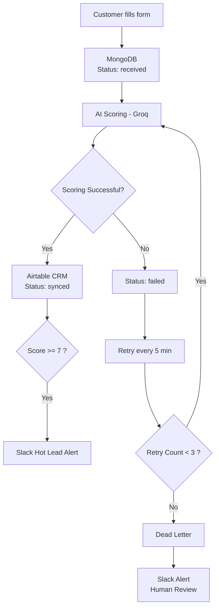

# AI Lead Qualification & Routing Pipeline

## What this does

A lead comes in (via webhook or form), gets scored by AI for sales-readiness,
and is automatically routed into a CRM. Hot leads trigger an instant Slack
alert. If the AI scoring call fails or times out, the lead is never lost —
it's automatically retried, and if it keeps failing, a human gets notified
instead of the lead silently disappearing.





     
## Stack

- **n8n** — webhook entry point and visual workflow orchestration
- **Node.js / Express** — core API (intake, scoring, retry logic)
- **MongoDB** — durable lead storage and the "queue" that makes this fault-tolerant
- **Groq (Llama 3.1)** — AI scoring, OpenAI-compatible API
- **Airtable** — mock CRM (same integration pattern as HubSpot/Salesforce)
- **Slack** — real-time alerts for hot leads and failures needing review

## The core design decision: capture before processing

The single most important choice in this system is that receiving a lead
and scoring a lead are two separate steps, not one. The moment a lead
arrives, it's saved to MongoDB with status `received` — before any AI call
happens. This means even if the AI provider is completely down, the lead
data is already safe. Nothing depends on the AI call succeeding in order
to not lose data.

## What happens when the AI call fails or times out

1. The lead is already saved (see above), so there's nothing to lose.
2. The scoring attempt fails (timeout, rate limit, bad response) — the lead
   is marked `failed` and a retry counter increments.
3. A scheduled job runs every 5 minutes, finds any `failed` leads, and
   retries them automatically.
4. If a lead fails 3 times total, it's marked `dead_letter` and a Slack
   alert fires so a human can step in. It never just disappears.

## Status lifecycle

`received` → `scored` → `synced` (success path)
`received` → `failed` → (retried) → `scored` → `synced`
`received` → `failed` → `failed` → `failed` → `dead_letter` (after 3 attempts)

## Setup

1. `npm install`
2. Copy `.env.example` to `.env` and fill in real credentials (MongoDB,
   Groq, Airtable, Slack webhook)
3. `npm run dev`
4. Send a POST request to `/api/leads/intake` with `{name, email, company, message}`
5. Score it via `POST /api/leads/score/:leadId`

## Folder structure

- `models/` — MongoDB schema
- `routes/` — API endpoints (intake, score, manual retry trigger)
- `services/` — isolated integrations (Groq scoring, Airtable sync, Slack alerts)
- `jobs/` — the scheduled retry job
- `config/` — database connection

## n8n workflow

The included n8n workflow (`n8n/lead-pipeline-workflow.json`) provides the
public-facing webhook entry point and a visual representation of the
success/failure routing. The actual scoring, retry, and escalation logic
lives in the Express API above — n8n orchestrates and visualizes it.


## Setup 
# Setup

## 1. Clone Repository

```bash
git clone <repo-url>
cd Lead-Pipeline
```

## 2. Install Dependencies

```bash
npm install
```

## 3. Create `.env`

```env
PORT=5001

MONGO_URI=your_mongodb_uri

GROQ_API_KEY=your_groq_api_key

AIRTABLE_API_KEY=your_airtable_token
AIRTABLE_BASE_ID=your_airtable_base_id

SLACK_WEBHOOK_URL=your_slack_webhook_url
```

## 4. Required Services

### MongoDB Atlas

* Create a free cluster
* Create a database user
* Add your IP to Network Access
* Copy the connection string

### Groq

* Create an API key
* Add it to `.env`

### Airtable

Create a base named **CRM_Mock** with a table named **Leads**.

| Field   | Type             |
| ------- | ---------------- |
| Lead ID | Single Line Text |
| Name    | Single Line Text |
| Email   | Single Line Text |
| Company | Single Line Text |
| Message | Long Text        |
| Score   | Number           |
| Summary | Long Text        |
| Status  | Single Select    |

Create a Personal Access Token with:

* `data.records:read`
* `data.records:write`

### Slack

* Create an Incoming Webhook
* Copy the webhook URL
* Add it to `.env`

## 5. Run Server

```bash
npm run dev
```

Expected output:

```bash
MongoDB connected
Retry job scheduled (every 5 minutes)
Server running on port 5001
```

## 6. Test Lead Intake

```bash
curl -X POST http://localhost:5001/api/leads/intake \
-H "Content-Type: application/json" \
-d '{
  "name":"Aarav Mehta",
  "email":"aarav@techverse.ai",
  "company":"TechVerse AI",
  "message":"Budget approved. Need AI automation within 30 days."
}'
```

## 7. Score Lead

```bash
curl -X POST http://localhost:5001/api/leads/score/<LEAD_ID>
```

## 8. Optional: Run n8n

```bash
docker run -it --rm -p 5678:5678 n8nio/n8n
```

Open:

```text
http://localhost:5678
```

Import the provided workflow and start testing.

```
```
